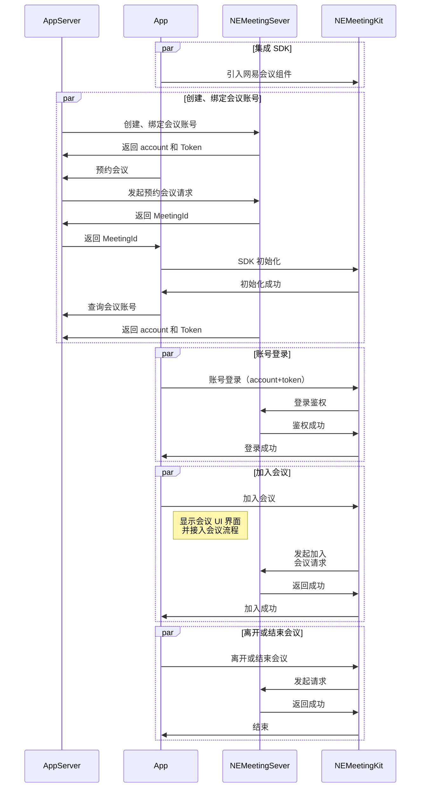

本系列文档您介绍如何通过 NEMeetingKit 提供的一套简单易用的接口，快速地将音视频会议基础功能集成至现有应用中。

## 前提条件

在使用网易会议组件之前，请确保您已经完成了以下操作：

- [集成并初始化 SDK](https://doc.yunxin.163.com/meeting/guide/zc2NzY3Mzg?platform=linux)
- [登录鉴权](https://doc.yunxin.163.com/meeting/guide/DI1MTY4Njc?platform=linux)

## API 时序

NEMeetingKit 实现在线会议的主要流程如下图所示：

更多详情，请参考 [客户端 API 文档](https://doc.yunxin.163.com/docs/interface/meetingkit/linux/doxygen/Latest/zh/class_n_e_meeting_kit.html)。