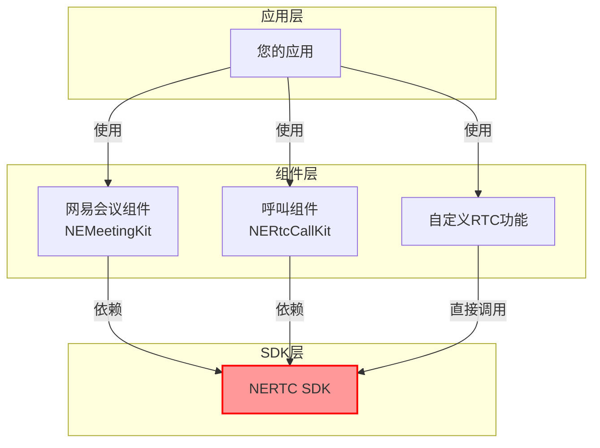
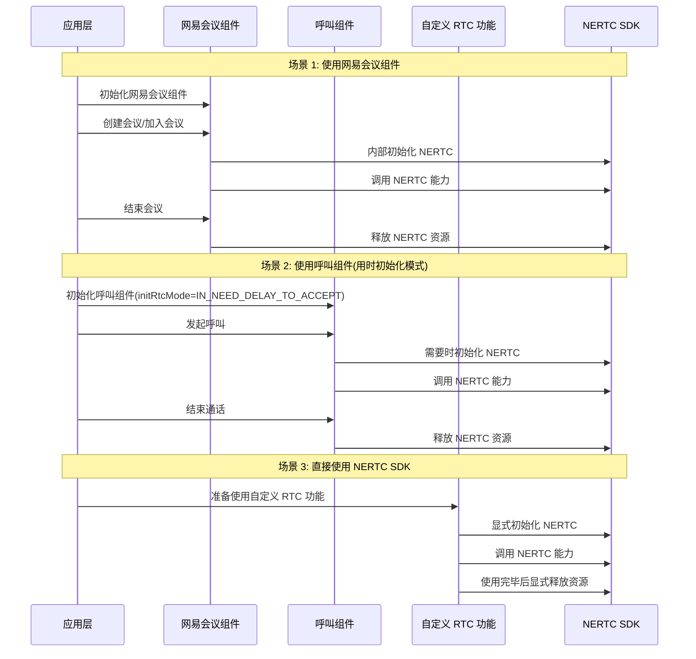

本文提供了网易会议组件 NEMeetingKit 各功能的起始版本及其对应的底层 SDK 依赖版本信息，以及如何修改会议组件底层的能力 SDK 版本。

## 底层依赖

网易会议组件中依赖了网易云信的 [即时通讯 NIM SDK（简称 NIM SDK）](https://doc.yunxin.163.com/messaging2/concept?platform=client) 和 [音视频通话 2.0 SDK（简称 NERTC SDK）](https://doc.yunxin.163.com/nertc/concept?platform=client) 的底层能力。您可以在网易会议组件的 [更新日志](https://doc.yunxin.163.com/meeting/guide/zk0MjM1OTg?platform=android) 中，查看到对应组件版本适配的 NIM SDK 和 NERTC SDK 版本。

- **功能选择**：根据所需功能特性，查找对应的起始版本，选择不低于该版本的 NEMeetingKit。
- **依赖管理**：确保项目中的 NIM SDK、NERTC SDK 和 NERoom 版本与所选 NEMeetingKit 版本兼容。
- **版本升级**：升级 NEMeetingKit 时，建议同步升级相关依赖 SDK 以获得最佳兼容性和性能。

<!-- 但在极少的场景下，会出现切换 NIM SDK 和 NERTC SDK 版本的需求。 -->

## 依赖版本切换

- 如果您的项目中已经单独集成了 NIM SDK 和 NERTC SDK，并与 NEMeetingKit 中的版本冲突时，您可以手工指定 NIM SDK 和 NERTC SDK 的版本号。具体实现请参考 [指定能力 SDK 版本](#指定能力-sdk-版本)。

- 如果您的应用中同时需要使用网易会议组件（NEMeetingKit）和 NERTC SDK 或呼叫组件时，由于它们都依赖了 NERTC SDK，可能会产生冲突。请参考 [与 NERTC SDK 和呼叫组件共存](#与-nertc-sdk-和呼叫组件共存) 了解如何处理音视频相关组件的冲突问题，避免因多组件依赖 NERTC SDK 而产生的冲突问题，确保应用稳定运行。

## 指定能力 SDK 版本

<!-- 但在极少的场景下，会出现切换 NIM SDK 和 NERTC SDK 版本的需求。-->如果您的项目中已经单独集成了 NIM SDK 和 NERTC SDK，并与 NEMeetingKit 中的版本冲突时，您可以手工指定 NIM SDK 和 NERTC SDK 的版本号。由于缺乏集成测试，切换的版本还可能会导致未知问题，因此建议您切换到与适配过的 NIM SDK 和 NERTC SDK 版本兼容的版本，例如 Hotfix 版本。

为避免引入 SDK 的时候，自动引入高版本的 NIM SDK 和 NERTC SDK，您可以在 [集成 SDK](https://doc.yunxin.163.com/meeting/guide/Dg4Njg3NDU?platform=android) 时，通过 Maven 仓库依赖添加目标的 NIM SDK 和 NERTC SDK 版本，并添加强制配置：

```Groovy
dependencies {
    implementation 'com.netease.yunxin.kit.meeting:meeting:x.x.x'
}
```

::: note note 
您可根据需要自行选择组件版本号，建议使用最新版本，详情可查看会议组件 [更新日志](https://doc.yunxin.163.com/meeting/guide/zk0MjM1OTg?platform=android)。
:::

### 指定 IM SDK 版本

```Groovy
// 替换 NIM SDK 版本，具体版本号可参考前文描述里的更新日志
configurations.all {
    // 指定为需要替换的 NIM SDK 版本号
    def overrideNimVersion = '9.15.0'
    resolutionStrategy.dependencySubstitution {
        all { DependencySubstitution dependency ->
            if (dependency.requested instanceof ModuleComponentSelector
                    && dependency.requested.group == 'com.netease.nimlib') {
                dependency.useTarget dependency.requested.group + ':' + dependency.requested.module + ':' + overrideNimVersion
            }
        }
    }
}
```

### 指定 NERTC SDK 版本

```Groovy
// 替换 NERTC SDK 版本，具体版本号可参考前文描述里的更新日志
configurations.all {
    // 指定为需要替换的 NERTC SDK 版本号
    def overrideNertcVersion = '5.5.30'
    resolutionStrategy.dependencySubstitution {
        all { DependencySubstitution dependency ->
            if (dependency.requested instanceof ModuleComponentSelector
                    && dependency.requested.group == 'com.netease.yunxin'
                && dependency.requested.module.startsWith('nertc-')
                    ) {
                dependency.useTarget dependency.requested.group + ':' + dependency.requested.module + ':' + overrideNertcVersion
            }
        }
    }
}
```

<a id="conflict"></a>

## 与 NERTC SDK 和呼叫组件共存

如果您的应用中同时需要使用网易会议组件（NEMeetingKit）和 NERTC SDK 或呼叫组件时，由于它们都依赖了 NERTC SDK，可能会产生冲突。本节介绍如何处理这种场景下的冲突问题，避免因多组件依赖 NERTC SDK 而产生的冲突问题，确保应用稳定运行。

下图展示了网易会议组件、呼叫组件和直接使用 NERTC SDK 三种场景的依赖关系：



### 共存原理

多种组件共存的核心原则是 **NERTC 即用即销**，具体做法如下：

- **按需初始化**：只在需要使用音视频功能时初始化 NERTC SDK。
- **及时销毁**：功能使用完毕后立即释放相关资源。
- **避免重复初始化**：确保不同组件不会同时初始化 NERTC SDK。
- **功能隔离**：设计应用 UI/UX 时，确保用户不能同时使用会议和 NERTC/呼叫功能。
- **版本兼容**：确保使用的网易会议组件和 NERTC/呼叫组件依赖的 NERTC SDK 版本相兼容，您可以在《呼叫组件》[更新日志](https://doc.yunxin.163.com/nertccallkit/concept/DMzOTI3NTA?platform=client) 中查看依赖的 NERTC SDK 版本号。

**NERTC SDK 在不同场景中的生命周期管理流程：**



### 网易会议组件与直接使用 NERTC SDK

如果您在应用中既使用网易会议组件，又直接使用 NERTC SDK 实现自定义功能，请遵循以下原则：

1. **业务隔离**：确保网易会议组件和自定义 NERTC 功能不会同时使用。
2. **NERTC 生命周期管理**：
   - 在使用自定义 NERTC 功能时，初始化 NERTC SDK。
   - 功能使用完毕后调用销毁方法（[`release`](https://doc.yunxin.163.com/nertc/references/android/doxygen/Latest/zh/html/classcom_1_1netease_1_1lava_1_1nertc_1_1sdk_1_1_n_e_rtc.html#adccc96746b013e42f18937482ed08ac5)）释放资源。

        ```Java
        // 释放 NERTC SDK 资源
        NERtcEx.getInstance().release()
        ```
        
   - 切换到网易会议组件创建会议/加入会议前确保已完全销毁 NERTC 实例。

### 网易会议组件与呼叫组件共存

呼叫组件提供了配置 NERTC 初始化时机的能力，可以设置为 **用时初始化**（[`IN_NEED_DELAY_TO_ACCEPT`](https://doc.yunxin.163.com/nertccallkit/references/android/doxygen/Latest/zh/html/interfacecom_1_1netease_1_1yunxin_1_1kit_1_1call_1_1p2p_1_1model_1_1_n_e_call_init_rtc_mode.html#a94adde2aeec663843a203f99d2c85d5b)）模式：

1. **呼叫组件配置**：

   ```Java
    CallKitUIOptions options = new CallKitUIOptions.Builder()
            .rtcAppKey("音视频通话 NERTC SDK 的 AppKey")
            .initRtcMode(NECallInitRtcMode.IN_NEED_DELAY_TO_ACCEPT) // 设置为用时初始化模式
            ......
            ......
            .build();
    CallKitUI.init(getApplicationContext(), options);
   ```

2. **避免同时使用**：确保呼叫组件和网易会议组件不会同时工作，使用一个功能前先完全退出另一个功能。如在会议过程中，如果接收到呼叫邀请，单击接听之前应该先调用接口退出会议，反之亦然。

## 下一步

完成版本选择后，您可以继续 [集成 SDK](https://doc.yunxin.163.com/meeting/guide/Dg4Njg3NDU?platform=android)。