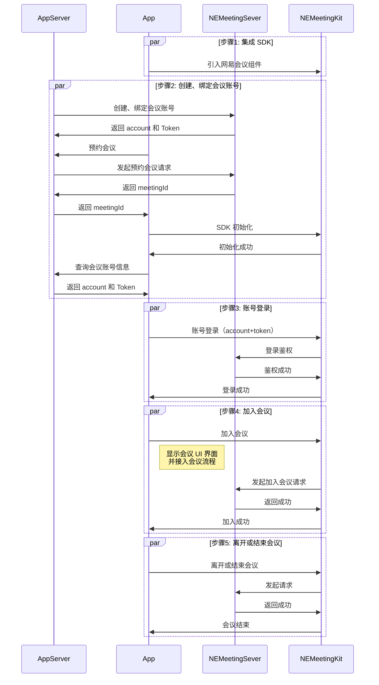

本系列文档介绍如何通过网易会议组件 NEMeetingKit 提供的一套简单易用的接口，快速地将音视频会议基础功能集成至现有安卓应用中。

## 前提条件

在使用网易会议组件之前，请确保您已经完成了以下操作：

- [集成并初始化 SDK](https://doc.yunxin.163.com/meeting/guide/jgyOTU0OTE?platform=h5#初始化)
- [登录鉴权](https://doc.yunxin.163.com/meeting/guide/DgxNTg1Njg?platform=h5)

## API 时序

下图展示了使用 NEMeetingKit 实现在线会议的主要流程，其中预约会议步骤是可选的，您也可以直接创建即时会议：

更多详情，请参考 [客户端 API 文档](https://doc.yunxin.163.com/meetingkit/references/web/typedoc/Latest/zh/h5/modules.html)。
<!-- 
## 集成说明

- **集成顺序**：
   - 必须先完成 SDK 集成、初始化和登录鉴权，才能进行后续操作。
   - 预约会议步骤是可选的，您也可以直接创建即时会议。

- **账号信息**：
   - account 是用户在网易会议系统中的唯一标识
   - token 是用于鉴权的凭证，有效期有限，过期需要重新获取

- **关于会议ID**：
   - meetingId 是会议的唯一标识符
   - 即时会议和预约会议都会生成唯一的 meetingId

- **会议操作**：
   - 会议创建者可以结束会议（所有人退出）
   - 普通参会者只能离开会议（自己退出） -->