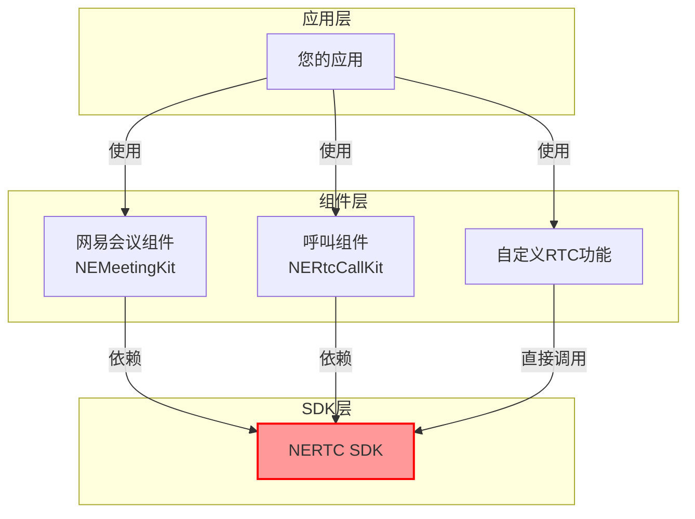
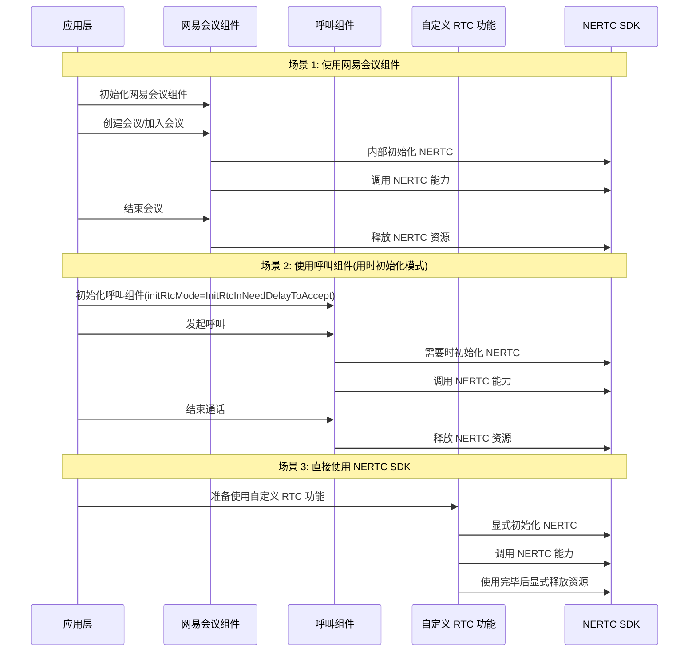

本文主要介绍如何解决网易会议组件 NEMeetingKit 底层的依赖冲突问题，帮助您根据需要的功能选择合适的版本组合。

## 使用说明

网易会议组件中依赖了网易云信的 [即时通讯 NIM SDK（简称 NIM SDK）](https://doc.yunxin.163.com/messaging2/concept?platform=client) 和 [音视频通话 2.0 SDK（简称 NERTC SDK）](https://doc.yunxin.163.com/nertc/concept?platform=client) 的底层能力。您可以在网易会议组件的 [更新日志](https://doc.yunxin.163.com/meeting/guide/jk0NzYzNzA?platform=iOS) 中，查看到对应组件版本适配的 NIM SDK 和 NERTC SDK 版本。

- **功能选择**：根据所需功能特性，查找对应的起始版本，选择不低于该版本的 NEMeetingKit。
- **依赖管理**：确保项目中的 NIM SDK、NERTC SDK 和 NERoom 版本与所选 NEMeetingKit 版本兼容。
- **版本升级**：升级 NEMeetingKit 时，建议同步升级相关依赖 SDK 以获得最佳兼容性和性能。

## XCode 版本依赖

从 NEMeetingKit 版本 4.14.0 开始，SDK 的最低支持版本由 iOS 12 提升至 iOS 13，开发环境需使用 Xcode 16.0 及以上版本。

<a id="override"></a>

## 指定能力 SDK 版本

<!-- 但在极少的场景下，会出现切换 NIM SDK 和 NERTC SDK 版本的需求。 -->如果您的项目中已经单独集成了 NIM SDK 和 NERTC SDK，并与 NEMeetingKit 中的版本冲突时，您可以手工指定 NIM SDK 和 NERTC SDK 的版本号。由于缺乏集成测试，切换的版本可能会导致未知问题，因此建议您切换到与适配过的 NIM SDK 和 NERTC SDK 版本兼容的版本，例如 Hotfix 版本。您可以通过 CocoaPods 仓库依赖添加目标的 NIM SDK 和 NERTC SDK 版本：

```CocoaPods
// 具体版本号可参考前文描述里的更新日志
// 如果您只想替换 NERTC SDK 或者 NIM SDK 的其中一个，则可以仅修改一个 SDK，但需要把另外一个 SDK 的版本设置为会议组件依赖的版本
pod 'NEMeetingKit/Special_All', '~> 4.7.0'

pod 'NERtcSDK', '{指定使用的版本}'

// NIMSDK_LITE 版本 必须
pod 'NIMSDK_LITE', '{指定使用的版本}'
```

## 修改能力 SDK 版本

### 底层依赖

网易会议组件中依赖了网易云信的 [即时通讯 NIM SDK（简称 NIM SDK）](https://doc.yunxin.163.com/messaging2/concept?platform=client) 和 [音视频通话 2.0 SDK（简称 NERTC SDK）](https://doc.yunxin.163.com/nertc/concept?platform=client) 的底层能力。您可以在网易会议组件的 [更新日志](https://doc.yunxin.163.com/meeting/guide/jk0NzYzNzA?platform=iOS) 中，查看到对应组件版本适配的 NIM SDK 和 NERTC SDK 版本。

<!-- 但在极少的场景下，会出现切换 NIM SDK 和 NERTC SDK 版本的需求。 -->

如果您的项目中已经单独集成了 NIM SDK 和 NERTC SDK，并与 NEMeetingKit 中的版本冲突时，您可以手工指定 NIM SDK 和 NERTC SDK 的版本号。具体实现方式，请参考《功能版本与 SDK 依赖对照》[修改能力 SDK 版本](https://doc.yunxin.163.com/meeting/guide/DM1MjE0Mjg?platform=android#iOS) 章节。

### 音视频相关

如果您的应用中同时需要使用网易会议组件（NEMeetingKit）和 NERTC SDK 或呼叫组件时，由于它们都依赖了 NERTC SDK，可能会产生冲突。请参考《功能版本与 SDK 依赖对照》[与 NERTC SDK 和呼叫组件共存](https://doc.yunxin.163.com/meeting/guide/DM1MjE0Mjg?platform=iOS#conflict) 了解如何处理音视频相关组件的冲突问题，避免因多组件依赖 NERTC SDK 而产生的冲突问题，确保应用稳定运行。

<a id="conflict"></a>

## 与 NERTC SDK 和呼叫组件共存

如果您的应用中同时需要使用网易会议组件（NEMeetingKit）和 NERTC SDK 或呼叫组件时，由于它们都依赖了 NERTC SDK，可能会产生冲突。本节介绍如何处理这种场景下的冲突问题，避免因多组件依赖 NERTC SDK 而产生的冲突问题，确保应用稳定运行。

下图展示了网易会议组件、呼叫组件和直接使用 NERTC SDK 三种场景的依赖关系：



### 共存原理

多种组件共存的核心原则是 **NERTC 即用即销**，具体做法如下：

- **按需初始化**：只在需要使用音视频功能时初始化 NERTC SDK。
- **及时销毁**：功能使用完毕后立即释放相关资源。
- **避免重复初始化**：确保不同组件不会同时初始化 NERTC SDK。
- **功能隔离**：设计应用 UI/UX 时，确保用户不能同时使用会议和 NERTC/呼叫功能。
- **版本兼容**：确保使用的网易会议组件和 NERTC/呼叫组件依赖的 NERTC SDK 版本相兼容，您可以在《呼叫组件》[更新日志](https://doc.yunxin.163.com/nertccallkit/concept/jIzNDA4Nzc?platform=client) 中查看依赖的 NERTC SDK 版本号。




### 网易会议组件与直接使用 NERTC SDK

如果您在应用中既使用网易会议组件，又直接使用 NERTC SDK 实现自定义功能，请遵循以下原则：

1. **业务隔离**：确保网易会议组件和自定义 NERTC 功能不会同时使用。
2. **NERTC 生命周期管理**：
   - 在使用自定义 NERTC 功能时，初始化 NERTC SDK。
   - 功能使用完毕后调用销毁方法（[`destroyEngine`](https://doc.yunxin.163.com/nertc/references/iOS/doxygen/Latest/zh/html/interface_n_e_rtc_engine.html#a48ce64655a2033a6e0d25f7308a7f0cc)）释放资源。
        ```Objective-C
        // 释放 NERTC SDK 资源
        [NERtcEngine destroyEngine];
        ```
   - 切换到网易会议组件创建会议/加入会议前确保已完全销毁 NERTC 实例。

### 网易会议组件与呼叫组件共存

呼叫组件提供了配置 NERTC 初始化时机的能力，可以设置为 **用时初始化**（[`InitRtcInNeedDelayToAccept`](https://doc.yunxin.163.com/nertccallkit/references/iOS/doxygen/Latest/zh/html/_n_e_call_engine_consts_8h.html#a1057b946e5616fa520275727bccd8316)）模式：

1. **呼叫组件配置**：

   ```Objective-C
   NESetupConfig *setupConfig = [[NESetupConfig alloc] initWithAppkey:@"音视频通话 NERTC SDK 的 AppKey"];
   setupConfig.initRtcMode = InitRtcInNeedDelayToAccept; // 设置为用时初始化模式
   [[NECallEngine sharedInstance] setup:setupConfig];

   NECallUIKitConfig *config = [[NECallUIKitConfig alloc] init];
   [[NERtcCallUIKit sharedInstance] setupWithConfig:config];
   ```

2. **避免同时使用**：确保呼叫组件和网易会议组件不会同时工作，使用一个功能前先完全退出另一个功能。如在会议过程中，如果接收到呼叫邀请，点击接听之前应该先调用接口退出会议，反之亦然。

## 下一步

完成版本选择后，您可以继续 [集成 SDK](https://doc.yunxin.163.com/meeting/guide/zg0NTkxMjY?platform=iOS)。